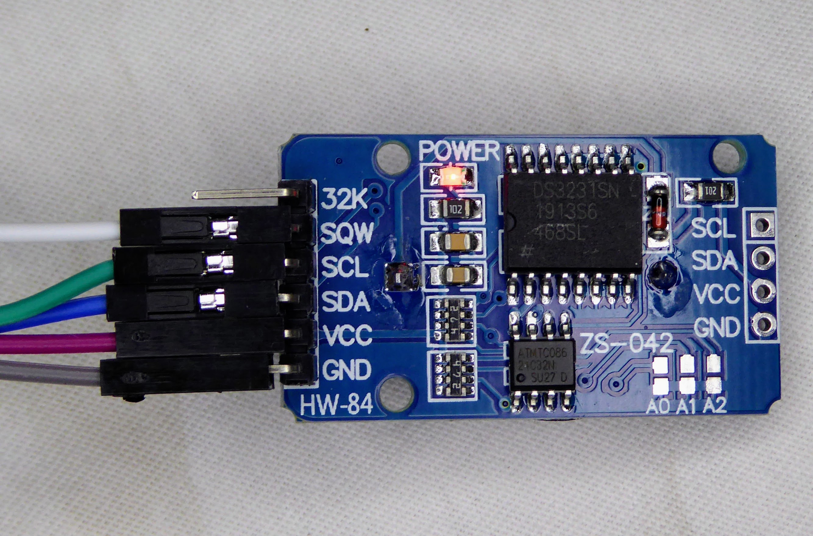
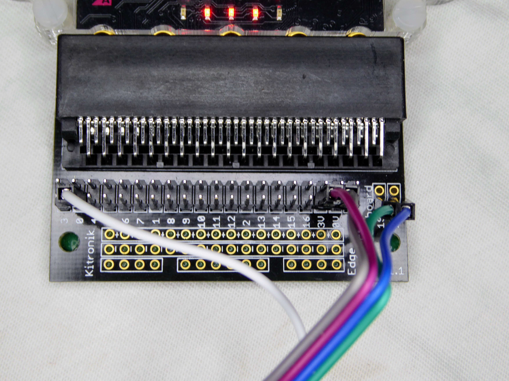

# DS3231-extension
This provides several functions for setting and reading:
* the Real Time Clock (RTC) time registers
* the 2 Alarm register sets (times and modes)
* Temperature

NOTE: The DS3231 chip allows alarm 1 to have seconds set, in addition to minutes, hours etc. This extension does NOT (yet) provide for that. In other words, both alarms can have minutes, hours etc set ONLY.

Also, functions are provided for handling the alarms:
* read status register (includes the alarm flags AnF)
* read control register
* enable/disable alarm (Status register)
* clear alarm flags (Status register)
* enable/disable INT pin (Control register)

## More on the functions
* xxx - read clock register where xxx is: year month date (week)day hour minute second
* status - read reg 0x0f
* control - read reg 0x0e
* set - all clock registers together: year month date (week)day hour minute second
* set Alarm time: alarm (1 | 2), mode (Minute | HourMinute | DateHourMinute | DayHourMinute)
and date day hour minute
* alarm interrupt enable (1 | 2) (Enable | Disable) AnIE => 1 | 0
* clear alarm flag: alarm (1 | 2) - resets AnF
* configure INTCN (Enable | Disable) - INTCN => 1 | 0
* temperature (upper) - signed (2's complement) of integer part of the on-chip temperature measurement
* temperature (lower) - the upper 2 bits are the fractional portion

## Example code
Set an alarm:

    DS3231.setAlarm(alarmNum.A1,mode.Minute,0,0,alarmHour,alarmMinute)

Record (over USB) a temperature measurement:

    serial.writeLine("Temperature: " + TwosCompToDec(DS3231.temperatureUpper()) + "." + Math.floor(DS3231.temperatureLower() / 64) * 25)

## The DS3231 RTC board
This is assumed to have an i2c address of 0x68.

I used [this one](https://www.ebay.co.uk/itm/DS3231-AT24C32-I2C-Precision-Real-Time-Clock-Memory-Module-for-Arduino/202481326337?ssPageName=STRK%3AMEBIDX%3AIT&_trksid=p2057872.m2749.l2649). It has a holder for a button cell for battery backup.

## How to use the interrupt
You can set one or both alarms in several different modes. To avoid having to poll the RTC to detect an alarm you would normally:
* enable the RTC interrupt, and 
* connect the interrupt pin (which is marked **SQW** on my RTC board) to a microbit pin - e.g. P0
* when the microbit detects that P0 has gone low then read the RTC's status register to see which alarm's flag bit has gone high
* then take whatever action you want, including (possibly) clearing that alarm flag.

## Testing
I connected the 3V, GND, SCL and SCK pins to the corresponding microbit pins. The DS3231 board's interrupt (SQW) pin was connected to the microbit's P0 pin.
The photos below show the board and the microbit.

### test.ts
Set time and alarm registers in "all" bit combinations, read back and verify
Basic function test in minute alarm mode to show use of interrupt
### functional.ts
Functional tests - read temperature, then set and wait for alarms.

